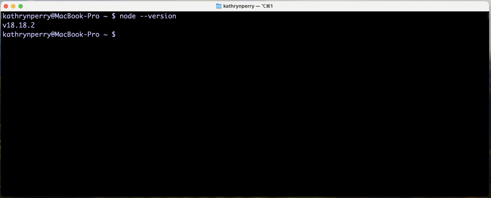
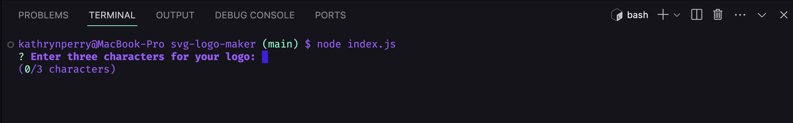
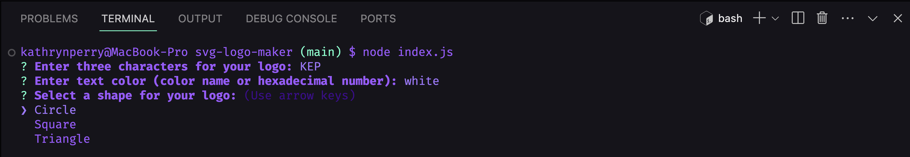
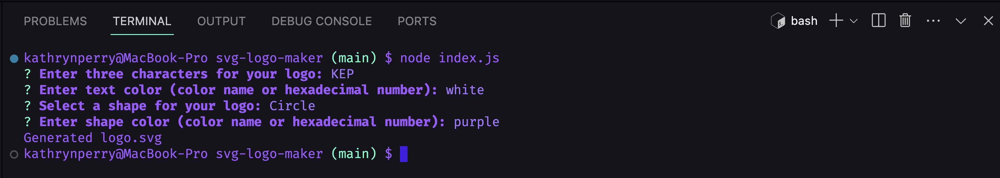
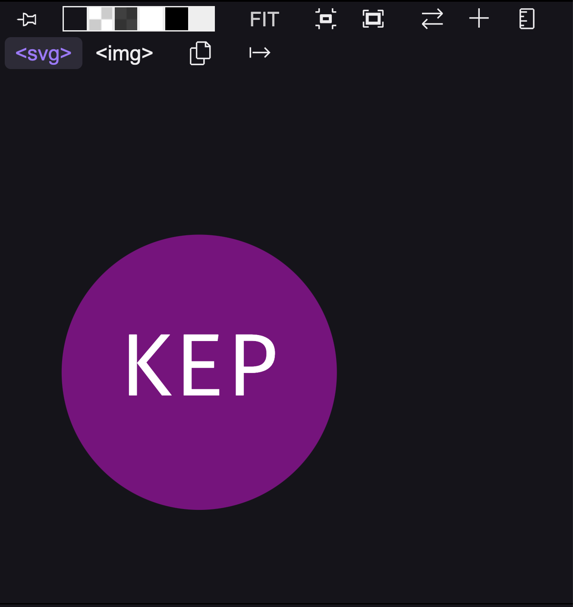
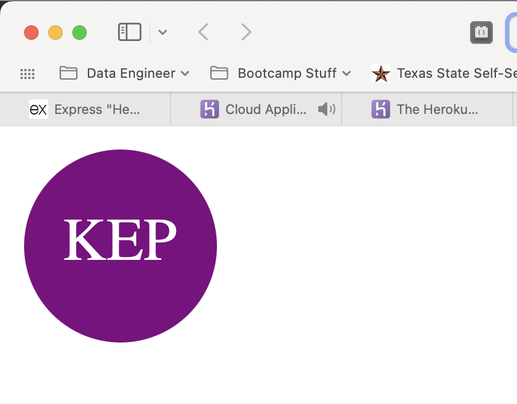
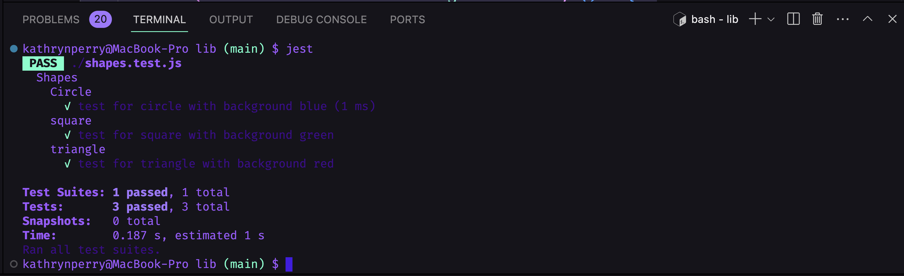

# svg-logo-maker

## Description

My motivation for this project was to create a simple logo maker by taking input from the user and generating a .svg file.

I built this project as a way to practice what I have learned in node, inquirer, fs, and jest. It is important to continue to work in the command line and refine the skills I have gained. This project also uses classes, which has been my introduction to OOP in JavaScript. 

This application allows a user to quickly create a simple logo by specifying their text, a shape, and color for the text and shape. While it isn't super fancy it does allow the user to come up with a little something to standout without having to enlist a professional designer. It is good for an initial logo that can be built upon at a later date.

I learned many things during the creation of this project. First and foremost I learned what a svg is - a scalable vector graphic. Once I had an understanding of the svg, and the fact that is uses xml, it was rather easy to work with. It was just a matter of creating a tag that can be inserted into an html file. I also learned more about test cases and using Jest. Writing test cases can be really simple, or become complex rather quickly. But the thing I think I was most excited to learn was the fact that I could add a maximum length to an input prompt with the inquirer package. The documentation for that was fairly simple to follow and using that negates the need for if/then statements to check for the length of the logo (as it is limited to three characters).

## Table of Contents

- [Installation](#installation)
- [Usage](#usage)
- [Credits](#credits)
- [Tests](#tests)
- [Questions](#questions)
- [License](#license)

## Installation

To use the logo maker program you must first do a couple of things.

- First, you'll want to copy this repository to your working space by using `git clone` so that you have it on your computer.
- Make sure your computer has node.js You can check by typing in the following in your command line: `node --version`
	- If node.js is installed you will see something like what is pictured below:
	
	If you do not get a result similar to what is pictured above then you don't have node.js installed. To install it simply go to [Node.js](https://nodejs.org/en).
- Once node is installed on your computer, from your project folder, run the following commands in the command line:
	- `npm init -y` This will initialize the node package and accept the defaults.
	- `npm i inquirer@8.2.4` This will install the inquirer package/dependencies, specifically version 8.2.4.
	- `npm i fs` This will install the fs package used to read and write to files.
	- `npm i inquirer-maxlength-input-prompt` This will install the package that allows you to use a maximum length requirement for an input. 

After those steps are completed you are ready to begin using the logo maker by running `node index.js`.

## Usage

The project is intended to be used as a way to create simple logos. Once you have the project downloaded you start it by running `node index.js` in the command line as seen below:

Once you have started the program you will get question prompts as seen below:

After you have finished entering your information, and there are no errors, you will receive an output statement that your logo.svg file as been generated as seen below:
 

You will also be able to view your logo.svg file to verify the tag is set up correctly as seen below:

**Note: Your logo.svg file will be located in the `examples` folder. You can change the location by changing the directory in the `writeToFile` function in the `index.js` file.**

And you can also preview your logo.svg in an internet browser as seen below:

To view a demonstration of the application click the following link:  
https://drive.google.com/file/d/1EzRCIcU1cDuo1S8oaA_-M3wWNWy5uqVR/view

## Credits

Anthony Strickland contributed to this project. You can view more of his work at his [GitHub Repository](https://github.com/AnthonyStrickland?tab=repositories).

The following websites were used to learn more about SVG:

https://www.w3schools.com/graphics/svg_intro.asp

https://developer.mozilla.org/en-US/docs/Web/SVG/Tutorial

https://developer.mozilla.org/en-US/docs/Web/SVG/Tutorial/Texts

The following website was used to implement maximum length for prompt input:

https://www.npmjs.com/package/inquirer-maxlength-input-prompt

## Tests

Test conducted on this project include testing the shape classes for circle, square, and triangle. I tested to ensure that when a color is added to the class the proper tag is rendered. See below for results:

## Questions

If you would like to know more about this project or to view other projects I have worked on please visit me at [kittykatt210](https://github.com/kittykatt210).

If you have any questions about this project that aren't answered in the github repository, I can be reached at keperry30@icloud.com.

## License
Copyright (c) Kathryn Perry. All rights reserved.  
Licensed under the [MIT](https://opensource.org/licenses/MIT) license.
